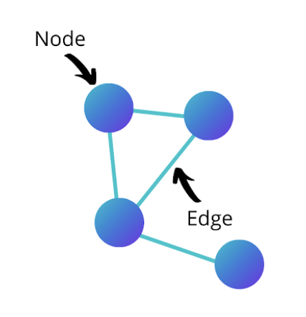

background-image: url(photos/alina-grubnyak-ZiQkhI7417A-unsplash.jpg)
background-size: cover
class: left, bottom

```{r, xaringanExtra-share-again, echo=FALSE}
#xaringanExtra::use_share_again()
```

```{r libraries, include = FALSE}
extrafont::loadfonts()
```

```{r, chunk-setup, include = FALSE}
knitr::opts_chunk$set(fig.retina = 3, 
                      fig.align = 'center',
                      warning = FALSE, 
                      message = FALSE)
```

```{css, echo=FALSE}
code.r.hljs.remark-code {
  position: relative;
  overflow-x: hidden;
}

code.r.hljs.remark-code:hover {
  overflow-x: visible;
  width: 500px;
  border-style: solid;
}
```


.my-black[
# NYC Campaign Finance Network Analysis
**Natalie O'Shea and Millie Olivia Symns**  
**BetaNYC | March 6, 2022**
]

---

# QUICK NOTES

#### This is a skeleton draft of the content for the slides

Ideas on flow: 
- Introduction of us
- Layout Agenda
- Background story to why we are here today 
- Going over the basics of network analysis 
- Quick breakdown on our tool of choice - R, RStudio Cloud?
- Live coding/walkthrough of Rmd
- Free exploration time?
- Closing remarks/conclusions + questions
- Thank you slide with contact information

Proposed presentation flow: 
- Natalie --> intro, agenda, backstory
- Millie --> basics explainations, set up intructions
- Natalie --> Live coding while Millie --> work around the room
- Millie --> future inspirations
- Natalie --> closing + thank you

---

class: transition-gradient-green, center, middle

.pull-left[
.my-white[
### Natalie O'Shea
<br>
#### Fact #1
#### Fact #2
#### Fact #3
]
]

.pull-right[

### Millie O. Symns

```{r, echo = FALSE, fig.align='center', out.width="50%"}

```
<br>
#### Data Analytics + Education Researcher 
#### Using R for 3+ years
#### Brooklyn Native
]

---

class: transition-gradient-green, left, middle

.pull-left[
.my-white[
## Agenda

#### 20 Mins (1:00 - 1:20 PM)
- Introductions + Background to R + RStudio Cloud Setup
- Technical Setup (R, RStudio Cloud)

#### 50 mins (1:20 - 2:10 PM)
- Defining Network Analysis
- Walkthrough 

#### 20 mins (2:10 - 2:30 PM)
- Exploration time
- Closing remarks

]
]

.pull-right[
```{r, echo = FALSE, fig.align='center', out.width="100%" , fig.cap= "Artwork by Allison Horst"}
knitr::include_graphics("photos/ahorst_welcome_to_rstats_twitter.png")
```
]
---

### Technical Set up

Fill in any details about making sure all systems are set (whether markdown or R script) and using the cloud.

---

### Tell a story

- Why are we doing this today?
- What are the questions or problems we are hoping to solve?

---

## What is a network analysis?

--

#### Wikipedia defines it as
> the process of investigating social structures through the use of networks and graph theory.


--
#### Simply stating ... 

--
.my-green[
### You're looking at relationships between people (or organizations) and creating visuals to represent it
]

--
This is done with some 
- data, 
- little bit of statistics, 
- and graphing 

---
class: transition-slide-green, center, middle

.my-white[ 
## Let's go over some terms you will hear and see today
]

---
## Social Network Terms

.pull-left[
```{r, echo = FALSE, fig.align='center', out.width="75%" , fig.cap= "from Builtin Article"}

```
]

.pull-right[

### Nodes (the dots)
> the people in your network


### Edges (the lines)
> the connections between people


### Centrality Measures (the stat)
> measures how important or influencial the node (person) in relation to the network

]

For details check out this helpful article: https://builtin.com/data-science/social-network-analysis
---

## R Terms 

.pull-left[

#### Libraries or Packages

```{r packages, eval=FALSE, echo=TRUE}
library(tidyverse)
library(igraph)
library(ggraph)
```
> A place where functions are held that will be use in our code

#### RMarkdown (Rmd) [or Script]  
> A place where code is written and can execute (run)

--> OTHER NOTES TO REMOVE
- describe how R is our tool of choice for analysis 
- R community and subcommunites
- Describe tools being used 

]


.pull-right[

```{r, echo = FALSE, fig.align='center', out.width="75%" , fig.cap= "Artwork by Allison Horst"}
knitr::include_graphics("photos/ahorst_heartyr.gif")
```
]

---

class: transition-slide-green, center, middle

.my-white[ 
## Time to do a walkthrough! 
]

---

## Network Analysis Inspiration

Look for data sets that records actions from people. 

Some examples include:
 - Reviews on products
 - Voting 
 - Social media connections 

For NYC Open Data: 

We created a data set collection using [Scout](https://scout.tsdataclinic.com/about) as a starting point for some inspriation to do your own network analysis.

Link: https://scout.tsdataclinic.com/collection/Network%20Analysis%20Inspo/3khw-qi8f,djnb-wcxt,m6nq-qud6

---

class: transition-slide-green, center, middle

.my-white[ 
## Time to explore! 
]

---

## Thank you!

It was lovely having you today! Feel free to connect with us :)


.pull-left[

### Natalie O'Shea

#### Twitter: @_natalie_oshea
#### Website: https://natalieoshea.github.io/website/

]

.pull-right[

### Millie O. Symns

#### Twitter: @millieosymns
#### Website: https://milliesymns.com

]

