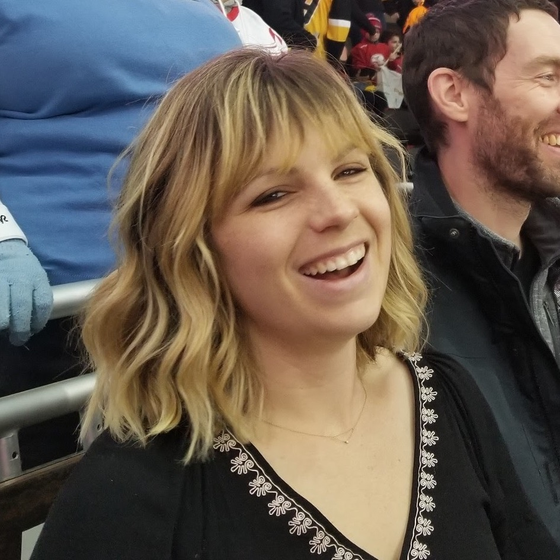
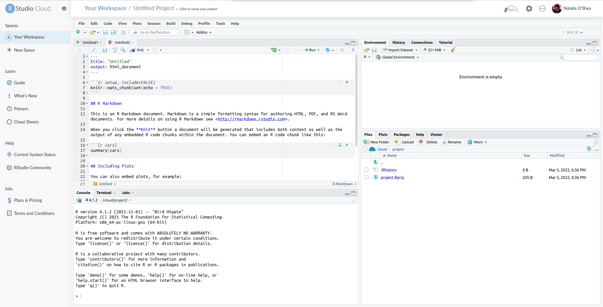
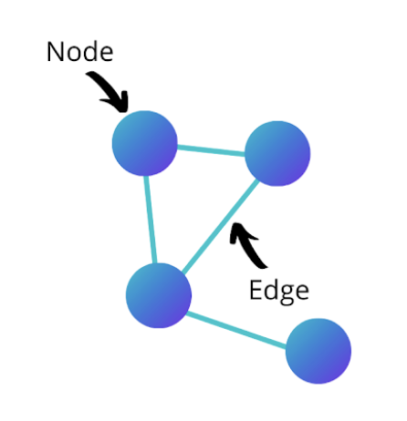

background-image: url(photos/alina-grubnyak-ZiQkhI7417A-unsplash.jpg)
background-size: cover
class: left, bottom

```{r, xaringanExtra-share-again, echo=FALSE}
#xaringanExtra::use_share_again()
```

```{r libraries, include = FALSE}
extrafont::loadfonts()
```

```{r, chunk-setup, include = FALSE}
knitr::opts_chunk$set(fig.retina = 3, 
                      fig.align = 'center',
                      warning = FALSE, 
                      message = FALSE)
```

```{css, echo=FALSE}
code.r.hljs.remark-code {
  position: relative;
  overflow-x: hidden;
}

code.r.hljs.remark-code:hover {
  overflow-x: visible;
  width: 500px;
  border-style: solid;
}
```


.my-black[
# NYC Campaign Finance Network Analysis
**Natalie O'Shea and Millie Olivia Symns**  
**BetaNYC | March 6, 2022**
]

---

class: transition-gradient-green, left, middle

.pull-left[
.my-white[
## Agenda

#### 15 Mins (1:00 - 1:15 PM)
- Introductions + Why Network Analysis
- Background to R + RStudio Cloud Setup
- Network Analysis Basics

#### 35 mins (1:15 - 1:50 PM)
- Live-code walkthrough analysis

#### 10 mins (1:50 - 2:00 PM)
- Additional datasets to explore
- Closing remarks

]
]

.pull-right[
```{r, echo = FALSE, fig.align='center', out.width="100%" , fig.cap= "Artwork by Allison Horst"}
knitr::include_graphics("photos/ahorst_welcome_to_rstats_twitter.png")
```
]
---

class: transition-gradient-green, center, middle

.pull-left[
.my-white[
### Natalie O'Shea
```{r, echo = FALSE, fig.align='center', out.width="50%"}

```
<br>
#### Analytics Consultant @ BetterUp
#### R enthusiast since 2014
#### CUNY-educated NYC transplant
]
]

.pull-right[

### Millie O. Symns

```{r, echo = FALSE, fig.align='center', out.width="50%"}
knitr::include_graphics("photos/msymns_square_profile.jpg")
```
<br>
#### Data Analytics + Education Researcher 
#### Using R for 3+ years
#### Brooklyn Native
]

---

### Data Science by Design (DSxD)

```{r, echo = FALSE, fig.align='center', out.width="60%"}
knitr::include_graphics("photos/dsxd.jpeg")
```

To learn more about the Data Science by Design community visit http://datasciencebydesign.org/

---

## Why Network Analysis?

.pull-left[

- Recently attended the [Recurse Center](https://www.recurse.com/), a self-directed educational programming retreat, where I worked on various fun programming projects
- As an anthropologist with a keen interest in how social change happens, network analysis had long been an area that I wanted to explore
- Potential for network analysis to be leveraged in future DEIB work

]
.pull-right[

```{r, echo = FALSE, fig.align='center', out.width="75%" , fig.cap= "Never Graduate!"}

```
]

---

## What is Network Analysis?

--

#### Wikipedia defines it as
> the process of investigating social structures through the use of networks and graph theory.


--
#### Simply stated ... 

--
.my-green[
### You're looking at relationships between people (or organizations) and creating visuals to represent it
]

--
This is done with some 
- data, 
- little bit of statistics, 
- and graphing 

---
class: transition-slide-green, center, middle

.my-white[ 
## Let's go over some terms you will hear and see today
]

---

## R Terms 

.pull-left[

#### Libraries or Packages

```{r packages, eval=FALSE, echo=TRUE}
library(tidyverse)
library(igraph)
library(ggraph)
```
- A place where functions are held that will be use in our code

#### RMarkdown (Rmd) [or Script]  
- A place where code is written and can execute (run)

]

.pull-right[

```{r, echo = FALSE, fig.align='center', out.width="75%" , fig.cap= "Artwork by Allison Horst"}

```
]

---

### RStudio Cloud

```{r, echo = FALSE, fig.align='center', out.width="85%"}

```


.center[
```{r installing, eval=FALSE, echo=TRUE}
install.packages(c("tidyverse", "igraph", "ggraph", "RSocrata", "networkD3"))
```
]
---

## Social Network Terms

.pull-left[
```{r, echo = FALSE, fig.align='center', out.width="60%" , fig.cap= "from Builtin Article"}

```
]

.pull-right[

### Nodes or Vertices (the dots)
- the people in your network


### Edges (the lines)
- the connections between people

]

For details check out this helpful article: https://builtin.com/data-science/social-network-analysis

---

## Social Network Terms

.pull-left[
```{r, echo = FALSE, fig.align='center', out.width="60%" }
knitr::include_graphics("photos/bookcover.jpg")
```
]

.pull-right[

### Node Centrality

  - How connected the individual is to other influential individuals
  - Useful for discovering "superconnectors"


### Detect Communities

  - Highly connected clusters of individuals
  - Useful for understanding what factors most influence community formation and whether communities are heavily segregated 

]
---

class: transition-slide-green, center, middle

.my-white[ 
## Time to do a walkthrough! 
Follow along by coding alongside us or by running the Rmd in our [GitHub repo](https://github.com/natalieoshea/nycopendata2022/blob/master/network-analysis.Rmd)! 
]

---

## Network Analysis Inspiration

Look for data sets that records actions from people. 

Some examples include:
 - Reviews on products
 - Voting 
 - Social media connections 

For NYC Open Data: 

We created a data set collection using [Scout](https://scout.tsdataclinic.com/about) as a starting point for some inspriation to do your own network analysis.

Link: https://scout.tsdataclinic.com/collection/Network%20Analysis%20Inspo/3khw-qi8f,djnb-wcxt,m6nq-qud6

---

## Thank you!

It was lovely having you today! 

Keep your eyes peeled for the upcoming "Future of Data Science" anthology by Data Science by Design (Twitter: `@DataScixDesign`)

Feel free to connect with us :)


.pull-left[

### Natalie O'Shea

#### Twitter: @_natalie_oshea
#### Website: https://natalieoshea.github.io/website/

]

.pull-right[

### Millie O. Symns

#### Twitter: @millieosymns
#### Website: https://milliesymns.com

]

